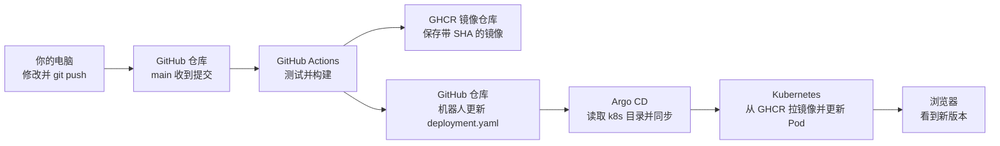

# 一次发布到底发生了什么

这份文档回答“GitHub Actions 怎么把镜像推送到 GHCR”“Argo CD 怎么知道要更新”“浏览器里怎么确认”等问题。先按 [01-使用文档](01-使用文档.md) 完成环境准备；这里沿着**一次实际发布**看每一站的输入、动作和结果。

本仓库是 `zsong0348-pixel/hello-k8s-cicd`。只有拥有这个仓库写权限的人才能按文中示例推送到 `main`。没有写权限可以阅读现有的 [成功运行记录](https://github.com/zsong0348-pixel/hello-k8s-cicd/actions/runs/35816162063)，不必为了练习而提交代码。

## 先看全图



这里有**两个不同的“推送”**：你用 `git push` 把代码推到 GitHub；GitHub Actions 在 GitHub 的临时 Ubuntu 机器上把 Docker 镜像推到 GHCR。它们的目的地和权限都不同。

| 名词 | 这个项目里的具体东西 | 谁使用它 |
|---|---|---|
| GitHub 仓库 | `zsong0348-pixel/hello-k8s-cicd`，存代码和 YAML | 你、Actions、Argo CD |
| GitHub Actions | `.github/workflows/ci-cd.yaml` 定义的自动任务 | GitHub 的临时运行机器 |
| Docker 镜像 | 由 `Dockerfile`、`app.py`、`requirements.txt` 构建的程序包 | Kubernetes 中的容器 |
| GHCR | `ghcr.io`，GitHub 的容器镜像仓库 | Actions 上传，Kubernetes 下载 |
| Argo CD | 监视 Git 中 `k8s/` 的部署工具 | 读取 YAML、更新集群 |
| Kubernetes | Docker Desktop 本地集群 | 拉镜像、运行两个 Pod |

## 第 1 站：你的代码进入 GitHub

在项目根目录修改 `app.py`，例如把首页的 `message` 改为 `hello from version 2`。确认改动后执行：

```powershell
git diff -- app.py
git add app.py
git commit -m "feat: change welcome message"
git push origin main
```

`git commit` 只在**你的电脑**创建提交，`git push origin main` 才把它送到 GitHub。推送前先按 [01-使用文档](01-使用文档.md) 第 5 节检查分支和工作区；远端有新提交时直接推送会被拒绝，不能用 `--force`。推送成功后打开仓库页面，确认最新提交就是你刚提交的那条。

**什么操作会触发流水线？** 当前配置是 `push` 到 `main`。只改 `docs/**` 或根目录 `README.md` 不触发；改 `app.py` 会触发。推到别的分支也不会执行这条发布流水线。入口是 [仓库 Actions 页面](https://github.com/zsong0348-pixel/hello-k8s-cicd/actions)。

## 第 2 站：Actions 自动测试

打开 Actions -> `ci-cd` -> 与你的提交对应的运行 -> `build-publish-deploy`。每一步会显示绿色成功或红色失败；点击步骤名能看日志。Actions 运行在 GitHub 提供的 `ubuntu-latest` 临时机器上，**不使用你的本地 Docker Desktop**。

工作流前几步的实际配置是：

```yaml
- name: Checkout
  uses: actions/checkout@v4
- name: Set up Python
  uses: actions/setup-python@v5
  with:
    python-version: '3.12'
- name: Test
  run: |
    python -m pip install -r requirements.txt
    python -c "from app import app; assert app.test_client().get('/healthz').status_code == 200"
```

`Checkout` 下载这次提交的文件，`Set up Python` 准备 Python 3.12，`Test` 安装依赖并检查 Flask 的 `/healthz` 返回 HTTP 200。测试失败时后面的镜像构建不会运行。**这个测试只检查健康接口状态码**，不会证明首页文字正确、容器一定能启动或集群一定能拉到镜像，所以发布后仍需最终验证。

## 第 3 站：Actions 构建并推送到 GHCR

这是“怎么推送镜像”的完整答案。工作流中的三段配置依次执行：

```yaml
permissions:
  contents: write
  packages: write

- name: Compute image name
  id: image
  shell: bash
  run: |
    owner=$(echo "${GITHUB_REPOSITORY_OWNER}" | tr '[:upper:]' '[:lower:]')
    echo "name=ghcr.io/${owner}/hello-k8s" >> "$GITHUB_OUTPUT"

- name: Log in to GHCR
  uses: docker/login-action@v3
  with:
    registry: ghcr.io
    username: ${{ github.actor }}
    password: ${{ secrets.GITHUB_TOKEN }}

- name: Build and push image
  uses: docker/build-push-action@v6
  with:
    context: .
    push: true
    tags: |
      ${{ steps.image.outputs.name }}:${{ github.sha }}
      ${{ steps.image.outputs.name }}:latest
```

1. `Compute image name` 生成 `ghcr.io/zsong0348-pixel/hello-k8s`。`ghcr.io` 是 GHCR 地址，后面是账号名和镜像名。账号名转小写，因为镜像路径应使用小写。
2. `Log in to GHCR` 在 **Actions 临时机器**上登录镜像仓库。用户名是触发运行的 GitHub 用户；密码是 GitHub 自动提供的本次运行 `GITHUB_TOKEN`。仓库给这个令牌 `packages: write` 才能上传镜像。你不需要在电脑上运行 `docker login`，也不需要把个人密码或 Token 写进 YAML。
3. `Build and push image` 读取项目根目录的 `Dockerfile`。Dockerfile 从 `python:3.12-slim` 开始，安装 `requirements.txt`，复制 `app.py`，以 Gunicorn 监听容器内的 8080 端口。`context: .` 表示使用仓库根目录文件；`push: true` 表示构建成功后由这个 Action 把镜像上传到 GHCR，而不只是留在临时机器上。
4. 同一个镜像会带两个标签：`:<完整提交SHA>` 和 `:latest`。Kubernetes 读取 `k8s/deployment.yaml` 中的 **SHA 标签**，不会用 `latest` 判断部署版本。

可以把第 2、3 步理解为下面的**等价概念**，这不是让小白额外执行的命令：

```text
在 GitHub 的临时机器登录 ghcr.io
docker build -t ghcr.io/zsong0348-pixel/hello-k8s:<本次提交SHA> .
docker push ghcr.io/zsong0348-pixel/hello-k8s:<本次提交SHA>
```

**到哪里看上传结果？** Actions 运行中，展开 `Build and push image`，成功时步骤为绿色；再到 GitHub 账号主页 -> `Packages` -> `hello-k8s` -> 版本列表，查找本次完整 SHA 标签。第一次成功上传会创建这个 Package，不需要先在 GitHub 页面手工新建。镜像包和代码仓库是两个位置。第一次发布后还要检查 Package 的 `Settings` -> `Change visibility`，确保本地集群可匿名拉取的镜像是 `Public`；代码仓库为 Public 并不能替代这一步。GHCR Public 镜像支持匿名拉取，Private 镜像则需另外给 Kubernetes 配置拉取凭证。参见 [GitHub 官方的镜像发布说明](https://docs.github.com/en/actions/tutorials/publish-packages/publish-docker-images)和 [Package 可见性说明](https://docs.github.com/en/packages/learn-github-packages/configuring-a-packages-access-control-and-visibility)。

若想用命令验证历史示例的镜像是否可公开下载，在 Docker Desktop 运行时执行：

```powershell
docker pull ghcr.io/zsong0348-pixel/hello-k8s:2eeee0eb84657d3dffce4e263c6554db6568ef50
```

成功时会显示下载完成和镜像摘要。这里的 SHA 是下文那条**历史运行**的示例；验证自己的发布时，要替换成自己这次 Actions 运行对应的完整 SHA。下载失败时先看错误提示：`unauthorized` 或 `denied` 优先查 Package 可见性，网络超时优先查本机到 `ghcr.io` 的连接。

## 第 4 站：Actions 告诉 Argo CD 要部署哪个镜像

镜像上传成功只是“仓库有货”，**并不等于 Kubernetes 已更新**。后续步骤把新镜像地址写进 Git：

```yaml
- name: Update Kubernetes image
  shell: bash
  env:
    IMAGE: ${{ steps.image.outputs.name }}
    SHA: ${{ github.sha }}
  run: |
    sed -i -E "s#image: .*#image: ${IMAGE}:${SHA}#" k8s/deployment.yaml
    sed -i -E "s/value: \".*\"/value: \"${SHA}\"/" k8s/deployment.yaml
```

例如这次代码提交是 `2eeee0eb84657d3dffce4e263c6554db6568ef50`，更新后的 `k8s/deployment.yaml` 有两处相同 SHA：

```yaml
image: ghcr.io/zsong0348-pixel/hello-k8s:2eeee0eb84657d3dffce4e263c6554db6568ef50
env:
  - name: APP_VERSION
    value: "2eeee0eb84657d3dffce4e263c6554db6568ef50"
```

`image` 让 Kubernetes 知道拉哪张镜像；`APP_VERSION` 让首页的 `version` 能显示对应 SHA。紧接着 `Commit deployment change` 用 `github-actions[bot]` 身份提交并 `git push` 回 `main`。真实例子是提交 [`c251466`](https://github.com/zsong0348-pixel/hello-k8s-cicd/commit/c251466996ad6e302e687a6b61167480239dedff)，提交说明为 `chore: deploy 2eeee0... [skip ci]`。这里的 `contents: write` 给机器人写回仓库的权限；如果分支保护不允许机器人推送，这一步会失败，即使 GHCR 上传已经成功。

## 第 5 站：Argo CD 更新本地 Kubernetes

Argo CD 的 `argocd-application.yaml` 指向本仓库的 `main` 分支、`k8s` 目录。本项目启用了自动同步。它发现机器人提交后，读取 `k8s/deployment.yaml`，把集群里的 Deployment 更新到新 SHA。Kubernetes 再从 GHCR **拉取**镜像，滚动创建两个新 Pod。Argo CD 不负责构建或上传镜像，Actions 也不会直接登录你的本地 Kubernetes。

在 PowerShell 中按顺序检查：

```powershell
kubectl config current-context
kubectl -n argocd get application hello-k8s
kubectl -n hello rollout status deployment/hello-k8s --timeout=5m
kubectl -n hello get deployment hello-k8s -o jsonpath="{.spec.template.spec.containers[0].image}"
kubectl -n hello get pods
```

当前 context 应是 `docker-desktop`；完成后 Application 应是 `Synced / Healthy`，Deployment 滚动更新成功，镜像地址末尾的 SHA 应与本次 Actions 构建的 SHA 相同，两个 Pod 应为 `1/1 Running`。刚推送时 `OutOfSync` 或 `Progressing` 可短暂出现。Argo 页面入口是 `https://localhost:8080/applications/argocd/hello-k8s?view=tree&resource=`，但只有本机的 `kubectl -n argocd port-forward svc/argocd-server 8080:443` 窗口仍在运行时才可访问；完整操作见 [03-ArgoCD使用文档](03-ArgoCD使用文档.md)。

## 第 6 站：浏览器确认发布成功

另开 PowerShell 并保持端口转发运行：

```powershell
kubectl -n hello port-forward svc/hello-k8s 8081:80
```

浏览器打开 `http://localhost:8081/`。如果你按第 1 站把首页文字改成 `hello from version 2`，应看到类似结果：

```json
{
  "message": "hello from version 2",
  "version": "本次提交的完整SHA"
}
```

这里的 JSON 是**操作示例**，`version` 应对照你自己这次 Actions 运行的提交 SHA；不能机械地期待固定字符串。再打开 `http://localhost:8081/healthz`，应看到 `{"status":"ok"}`。`port-forward` 只提供本机访问入口，不是一次部署动作；关闭窗口后应用仍在集群中运行。

## 用一条真实记录练习核对

仓库已有一次可供观察的发布，不必制造新提交：

| 检查位置 | 应找到的证据 |
|---|---|
| [Actions 运行](https://github.com/zsong0348-pixel/hello-k8s-cicd/actions/runs/35816162063) | `ci-cd` 成功，运行对应提交 `2eeee0eb...`。登录 GitHub 后展开步骤看日志。 |
| GHCR `hello-k8s` 版本列表 | 标签 `2eeee0eb84657d3dffce4e263c6554db6568ef50`。 |
| [机器人提交](https://github.com/zsong0348-pixel/hello-k8s-cicd/commit/c251466996ad6e302e687a6b61167480239dedff) | `k8s/deployment.yaml` 中的 `image` 和 `APP_VERSION` 都改为该 SHA。 |
| 本地集群 | 若仍部署此版本，`kubectl ... jsonpath` 输出的镜像以该 SHA 结尾；若已经发布了更新版本，应以最新运行的 SHA 为准。 |

## 常见疑问与失败位置

| 问题 | 直接看哪里 |
|---|---|
| 推送代码后没有 Actions 运行？ | 看是否推到 `main`，是否只改了 `docs/**` 或根目录 `README.md`，以及仓库 Actions 是否启用。 |
| `Test` 失败？ | 展开 Actions 的 `Test`，查看依赖安装错误或 `/healthz` 状态码；镜像不会继续发布。 |
| `Log in to GHCR` 或 `Build and push image` 失败？ | 看该步骤日志，核对 `packages: write`、Package 的 Actions 访问权限、镜像名及 GitHub 服务状态。 |
| GHCR 有新镜像，但页面还是旧版？ | 先看 `Commit deployment change` 是否成功，再看机器人提交、Argo 同步状态和 Deployment 镜像 SHA。 |
| Pod 显示 `ImagePullBackOff`？ | 按 [01-使用文档](01-使用文档.md) 第 6 节获取 `$podName`，再运行 `kubectl -n hello describe pod $podName` 看 Events；核对 GHCR Package 可见性和镜像标签。 |
| 为什么还要 Argo CD？ | Actions 只把新镜像和目标版本放到 GHCR/Git；Argo CD 读取 Git，负责把声明应用到本地集群。 |
| 为什么同时有 SHA 和 `latest`？ | `latest` 方便临时查看，部署文件固定使用 SHA，才能明确知道正在运行哪次提交。 |

GitHub 的 [运行日志说明](https://docs.github.com/en/actions/how-tos/monitor-workflows/use-workflow-run-logs)列出如何逐步骤看成功或失败。不要在公开截图或文档中粘贴令牌、密码或完整私有日志。
